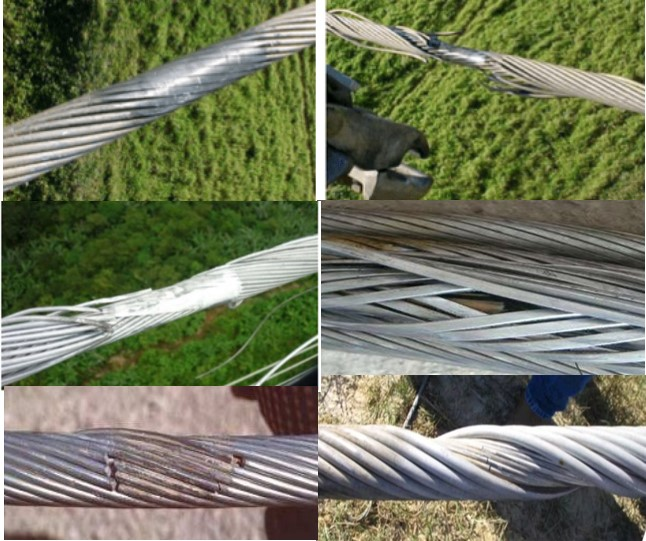

# A multi-coil cascaded detection method based on pulsed eddy current for identifying broken strand faults in transmission lines（updating!）

***Author: Yunxing Pu, Northeastern University.*** 

***This paper has not yet been published, so specific details of the simulations are not provided at this time.***

***Readers are welcome to engage in discussions with me. Contact email: pu_yunxing@163.com***

## Ⅰ. Background

&emsp;Transmission lines are a crucial component of the power grid. Currently, the majority of high-voltage transmission lines utilize steel-cored aluminum stranded conductors. However, during their operational lifespan, various types of damage can occur. Detecting these types of damages early on is challenging through overall line monitoring of voltage, current, power, and other signals. Nevertheless, the accumulation of these defects can significantly impact the reliability of the transmission system. Currently, there is limited research focused on this specific area, highlighting the urgent need for the development of efficient and reliable methods for detecting internal and external flaws, enabling periodic non-destructive testing of power transmission lines.

Fig.1. Wind-induced damage & Lightning strike damage

Fig.2. Installation damage & Corrosion damage

## Ⅱ. Principle of PEMEC detection

### Ⅱ.1. Detection target

&emsp;&emsp;This study focuses on the LAG240/30 steel-cored aluminum stranded conductor model, which consists of two outer layers of aluminum and an inner steel core.

Fig.3. Photo of the cross-section and schematic diagram of the LGJ-240/30 cable.

Fig.4. The Angle of the LGJ-240/30 cable.

&emsp;According to reference materials, the stranding lay angles of the outer layer strands of this ACSR twisted pair transmission line are 12°-13°, and the lay angles of the inner layer strands are 14°-15°.

## Ⅱ. Simulation Experiments

### Ⅱ.1 Simplified Model

#### (1) Ansys maxwell & simplore

$$
\phi  = {\mu _0}{\mu _r}{\mu _{eff}}{H_0}\pi {a^2} + {\mu _0}{H_0}\pi ({b^2} - {a^2})
$$

&emsp;In most cases, when studying problems related to metallic stranded wires, we typically simplify them as metallic cylinders for various electromagnetic calculations and analyses.

Fig.5.Maxwell circuit (simplore) & Maxwell model

Fig.6. Eddy Current Distributions at Different Frequencies. (500Hz-1kHz-5kHz)

&emsp;It can be observed that the eddy currents diffuse and extend along the edges of the simplified cylindrical model, attenuating inward. And due to the skin effect, the higher the frequency, the lower the penetration depth of the eddy currents.

Fig.7. Spatial Magnetic Field Distribution and Tangential Eddy Current Attenuation Curve at 5kHz along the Cylinder

#### (2) COMSOL

&emsp;Similarly, we conducted test experiments on the eddy current and magnetic field distributions in COMSOL, and the results were consistent with the Maxwell test results.

Fig.8. Magnetic Field and Eddy Current Distributions in the Simplified Model

### Ⅱ.2 Stranded Conductor Model — COMSOL

&emsp;Compared to the simplified model, the stranded wire model is closer to the actual condition.

Fig.9. Solidworks model

Fig.10. Magnetic Field and Eddy Current Distributions in the Stranded Wire Model at 1kHz

&emsp;It can be clearly contrasted that, <strong style="color:red;">compared to the simplified model, the magnetic field and eddy currents in the stranded wire model do not diffuse from the periphery inward. Instead, they are distributed among the gaps between the strands.</strong>

&emsp;I believe this phenomenon can be explained by eddy current shielding and attenuation effects. Compared to the continuous aluminum metal of the simplified model, the continuity of the metal strands in the stranded wire model is much weaker. This limits the formation of a circulating eddy current encompassing the entire cylindrical cross-section, which would strongly shield the interior from magnetic flux penetration. Instead, eddy currents in the stranded model exist only within the tangential cross-section of each strand, providing weaker shielding and allowing deeper flux penetration. Furthermore, the relative strength of these localized eddy currents is weaker compared to that induced in the steel core!

## Ⅲ. Experiment

&emsp;Referencing theoretical calculations, we designed several coil models with different turn number ratios to conduct experiments.

Fig.11. Coil model & Experiment

